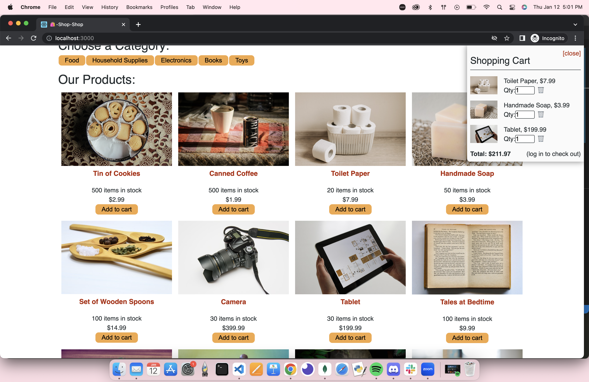
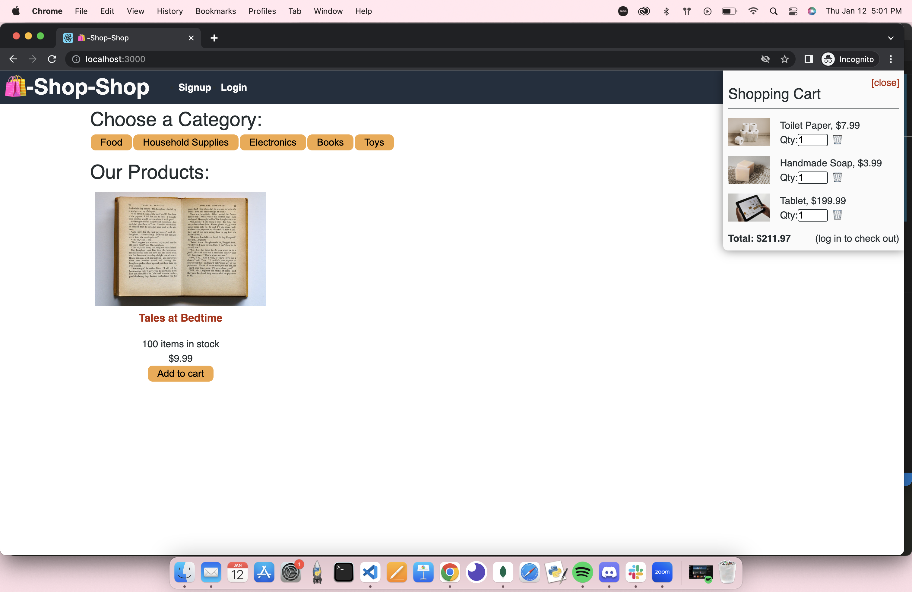
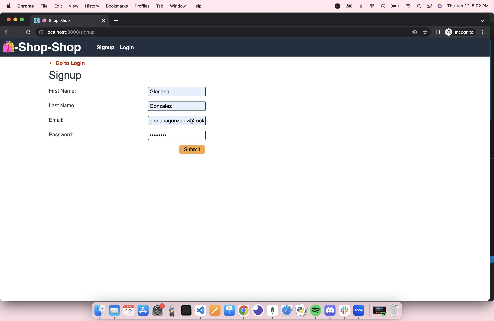
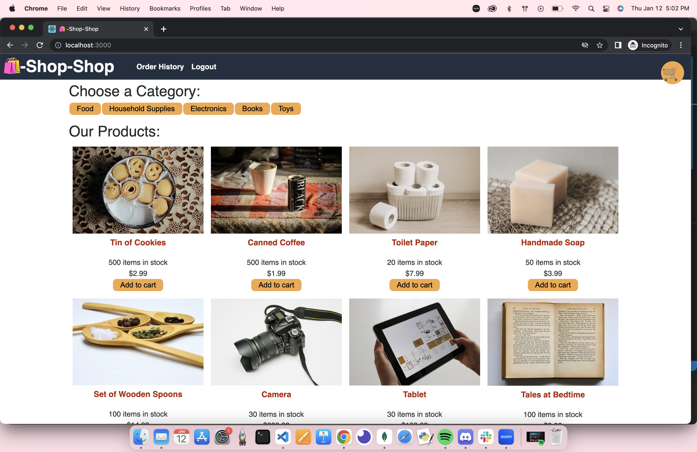

# Redux Shop
Refactored e-commerce platform from Activity 26, Module 22, so that it uses Redux

# Ojectives
- An e-commerce platform that uses Redux to manage global state
- App uses a Redux store instead of the Context API
- App uses a Redux provider
- App passes reducers to a Redux store instead of using the Context API
- App uses Redux instead of the Context API
- App uses Redux instead of the Context API

# Usage
- From the command line: 
    - Run `npm i`
    - Run `npm run seed`
    - Run `npm run start`
    - A browser will open at `http://localhost:3000/`
        - `if another application opens, use an icognito window`

# Technologies
- "@apollo/react-hooks": "^3.1.3"
- "@reduxjs/toolkit": "^1.5.0"
- "@stripe/stripe-js": "^1.11.0"
- "@testing-library/jest-dom": "^4.2.4"
- "@testing-library/react": "^9.5.0"
- "@testing-library/user-event": "^7.2.1"
- "apollo-boost": "^0.4.7"
- "apollo-link-context": "^1.0.20"
- "graphql": "^14.6.0"
- "graphql-tag": "^2.10.3"
- "jwt-decode": "^2.2.0"
- "react": "^16.13.1"
- "react-dom": "^16.13.1"
- "react-redux": "^7.2.2"
- "react-router-dom": "^5.1.2"
- "react-scripts": "3.4.1"

# Images

